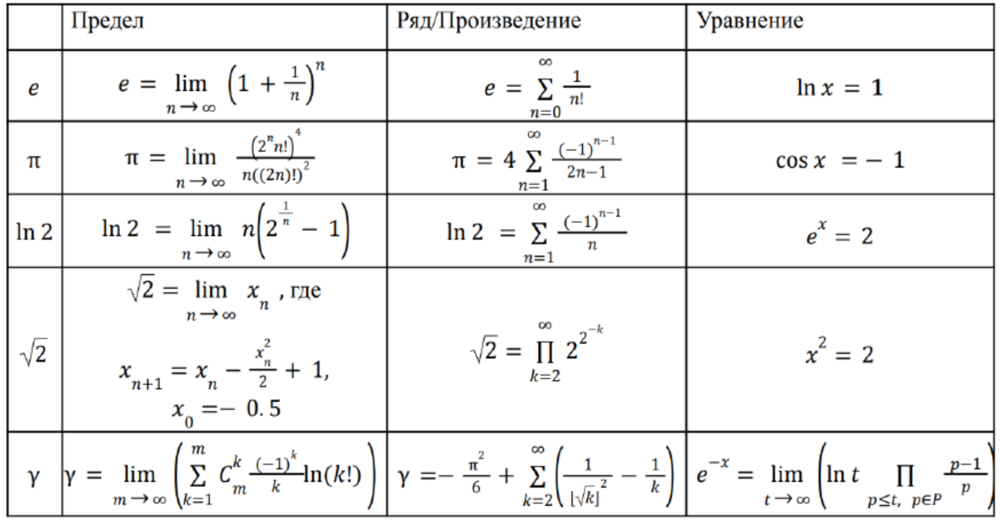

# Работа №1, задача №4

Реализовать функции, вычисляющие значения чисел: $e$ , $π$ , $ln 2$ , $2$ , $γ$;
с заданной точностью. Для каждой константы реализовать три способа вычисления: 
как сумму ряда, как решение специального уравнения, как значение предела. 
При вычислении необходимо использовать ранее вычисленные результаты.

